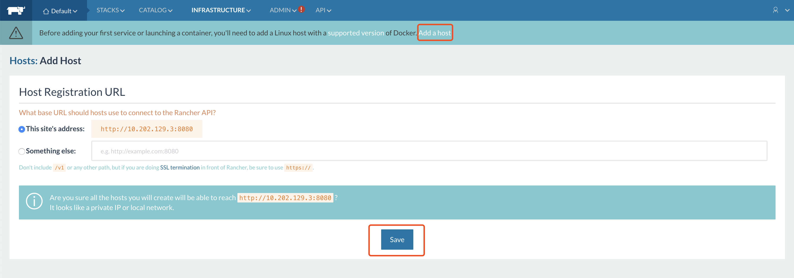
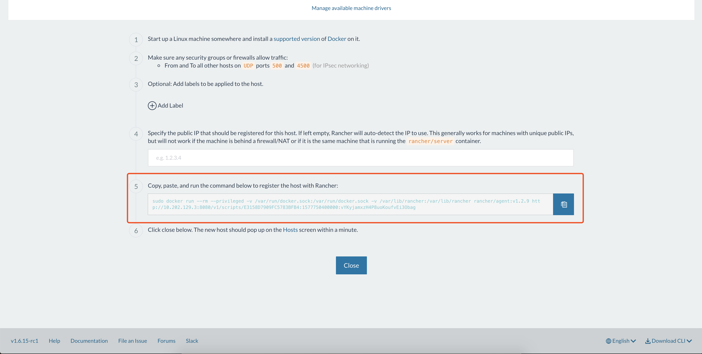
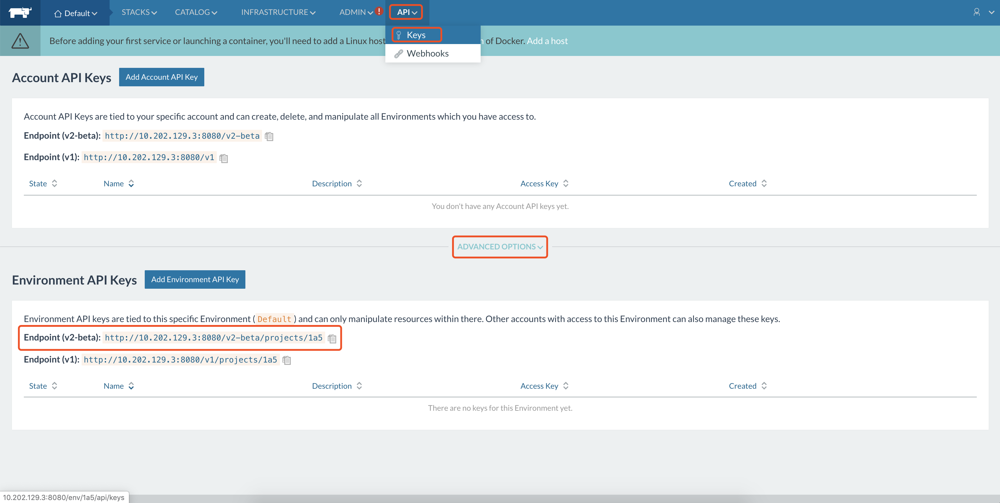
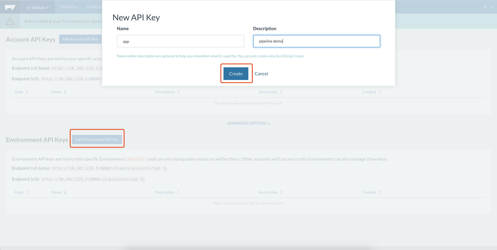
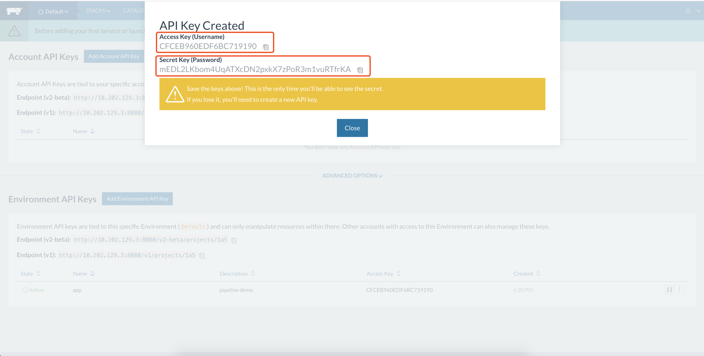
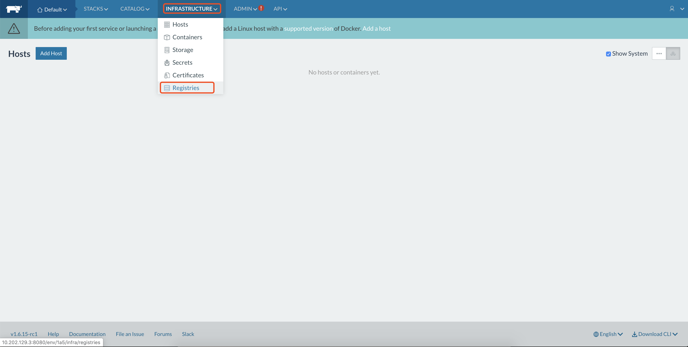
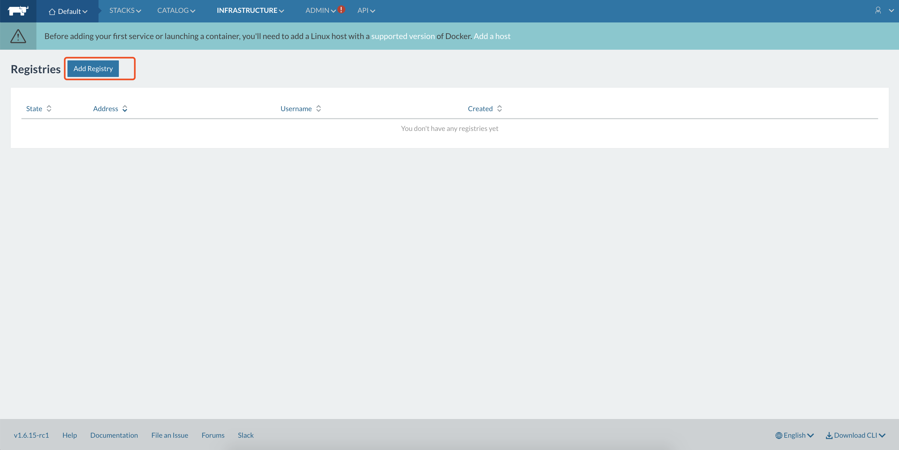
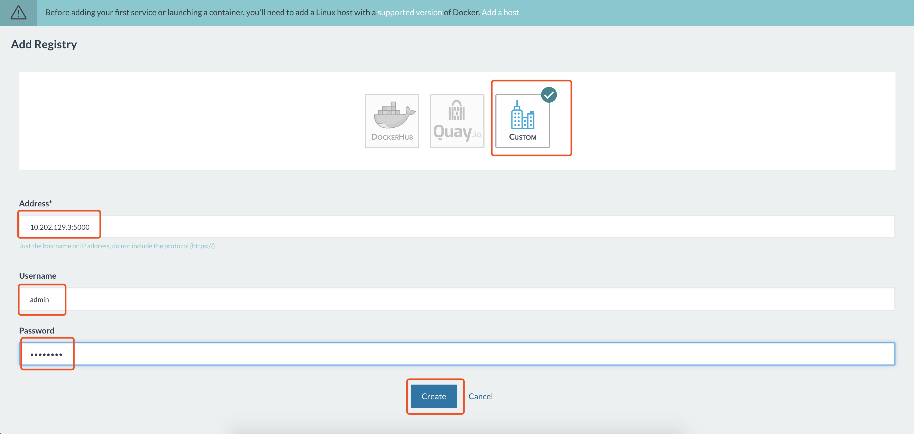
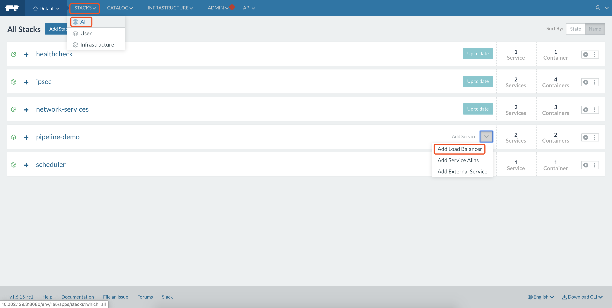
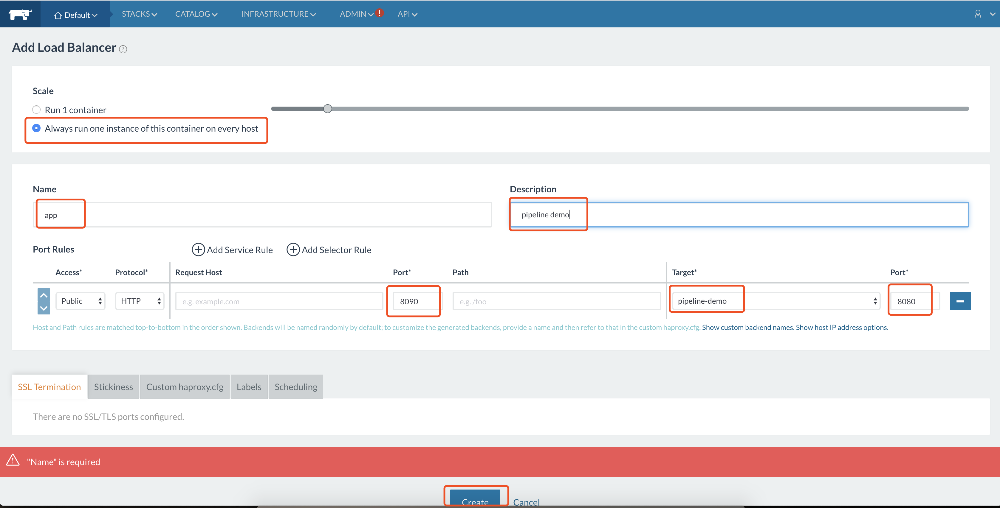

#### build pipeline using gocd

##### 1. 配置虚拟机

* 下载安装 Vagrant 和 Virtualbox

* 创建gocd虚拟机(**10.29.5.155**)

  * `~/Documents/projects/gocd-pipeline-env/gocd`目录下新建`Vagrantfile`

  ```
  Vagrant.configure("2") do |config|
    config.vm.define :ci do |config|
       config.vm.box = "ubuntu/trusty64"
       config.vm.hostname = "gocd"
       config.vm.synced_folder "~/Documents/projects/gocd-pipeline-env/gocd/vagrant_shared", "/vagrant"
       config.vm.network :private_network, ip: "10.29.5.155"
       config.vm.provision :shell, path: "~/Documents/projects/gocd-pipeline-env/gocd/vagrant_shared/setup_docker.sh"
       config.vm.provider "virtualbox" do |vb|
         vb.memory = "4096"
       end
     end
  end
  ```

* 创建nexus & rancher虚拟机(**10.202.129.3**)

  * `~/Documents/projects/gocd-pipeline-env/nexusAndRancher`目录下新建`Vagrantfile`

  ```
  Vagrant.configure("2") do |config|
    config.vm.define :ci do |config|
       config.vm.box = "ubuntu/trusty64"
       config.vm.hostname = "nexusAndRancher"
       config.vm.synced_folder "~/Documents/projects/gocd-pipeline-env/nexusAndRancher/vagrant_shared", "/vagrant"
       config.vm.network :private_network, ip: "10.202.129.3"
       config.vm.provision :shell, path: "~/Documents/projects/gocd-pipeline-env/nexusAndRancher/vagrant_shared/setup_docker.sh"
       config.vm.provider "virtualbox" do |vb|
         vb.memory = "4096"
       end
     end
  end
  ```

* `~/Documents/projects/gocd-pipeline-env/nexusAndRancher/vagrant_shared`目录下创建`setup_docker.sh`

  ```sh
  #! /usr/bin/env bash
  
  curl -fsSL get.docker.com -o get-docker.sh
  sudo sh get-docker.sh
  sudo usermod -aG docker vagrant #授权docker进程对应的用户是vagrant
  
  sudo curl -L https://github.com/docker/compose/releases/download/1.18.0/docker-compose-`uname -s`-`uname -m` -o /usr/local/bin/docker-compose
  sudo chmod +x /usr/local/bin/docker-compose
  ```

##### 2. 配置nexus

 1. 启动容器

    `docker run -d -u root -v $(pwd)/nexus-data:/nexus-data -p 5000:5000 -p 8081:8081 sonatype/nexus3`

 2. 创建docker的私有仓库

    * 访问nexus[主页](http://10.202.129.3:8081)
    * 登录，密码在虚拟机中的`~/nexus-data/admin.password`，修改密码为**admin123**
    * 创建docker私有仓库docker(hosted)，http代理端口为5000

 3. 配置docker的registry

    * `vim /etc/default/docker`注意权限
    * 添加`DOCKER_OPTS="--insecure-registry 10.202.129.3:5000"`
    * 重启`sudo service docker restart`
    * 重新启动nexus容器
    * `10.29.5.155`虚拟机也需如此配置

 4. 登录docker私有仓库

    `docker login 10.202.129.3:5000 -u admin -p admin123`

**注意**

登录私有仓库提示OCI错误，原因是docker-ce版本低了

`sudo apt-get install docker-ce=18.06.1~ce~3-0~ubuntu`

##### 3. 配置GoCD

1. 启动go server容器

   `docker run -d -v $(pwd)/go-server:/godata -v $HOME:/home/go -p8153:8153 -p8154:8154 gocd/gocd-server:v17.12.0`

2. 构建go agent，在agent中启动rancher-compose

   * Dockerfile

     ```
     FROM gocd/gocd-agent-alpine-3.5:v17.12.0
     MAINTAINER zijie <zijie.jiang@thoughtworks.com>
     WORKDIR /opt
     RUN apk update && apk add docker
     RUN curl -O -L https://github.com/rancher/rancher-compose/releases/download/v0.12.5/rancher-compose-linux-amd64-v0.12.5.tar.gz \
            && tar -xvf rancher-compose-linux-amd64-v0.12.5.tar.gz \
            && mv rancher-compose-v0.12.5/rancher-compose /usr/local/bin/
     ```

   * `docker build -t gocd/gocd-agent-alpine-3.5:v17.12.0-rancher ./`

3. 启动go agent容器

   * `sudo chmod 666 /var/run/docker.sock`
   * 切换到`/etc/default`目录下
   * 访问go server config`http://10.29.5.155:8153/go/admin/config_xml`
   * 
   * `docker run -d -e WORKDIR=$(pwd)/go-agent -e GO_SERVER_URL=https://10.29.5.155:8154/go -v $(pwd)/go-agent:/godata -v /var/run/docker.sock:/var/run/docker.sock:rw -v $HOME/.docker:/home/go/.docker:rw -e AGENT_AUTO_REGISTER_KEY=15fd160b-cce7-4011-8f5d-5565a366bbf5 -e AGENT_AUTO_REGISTER_RESOURCES=docker -e AGENT_AUTO_REGISTER_HOSTNAME=superman gocd/gocd-agent-alpine-3.5:v17.12.0-rancher`
   * 根据图示位置替换上述命令中的`AGENT_AUTO_REGISTER_KEY`值

##### 4. pipeline as code

- 在`start.spring.io`创建一个gradle项目，上传到自己的github上

- 在go server中配置我们该项目的路径，**go server将自动拉取项目并读取项目下的.gocd.yml后缀的文件创建对应的pipeline**

  ```xml
  <server />
  <config-repos>
      <config-repo pluginId="yaml.config.plugin" id="demo">
        <git url="https://github.com/foolname/gocd-pipeline-demo.git" />
      </config-repo>
  </config-repos>
  ```

- 创建`pipeline`目录并下面创建`demo.gocd.yml`文件

  ```yml
  pipelines:
    pipeline-demo:
      group: demo
      label_template: "${COUNT}"
      locking: off
      materials:
        app:
          git: https://github.com/foolname/gocd-pipeline-demo.git
          branch: master
      stages:
        - test:
            clean_workspace: true
            jobs:
              test:
                tasks:
                  - exec:
                      command: bash
                      arguments:
                        - "./scripts/test.sh"
                      run_if: passed
        - build:
            clean_workspace: yes
            jobs:
              build:
                tasks:
                  - exec:
                      command: bash
                      arguments:
                        - "./scripts/build.sh"
                      run_if: passed
  ```

- 创建`scripts`目录并在下面创建`test.sh`和`build.sh`

  - `test.sh`

    ```shell
    #! /usr/bin/env bash
    set -x
    set -e
    
    docker run --rm \
        -v /tmp/gradle:/home/gradle/.gradle \
        -v $WORKDIR/pipelines/$GO_PIPELINE_NAME:/home/gradle \
        -w /home/gradle \
        gradle:4.4-jdk8 \
        ./gradlew clean test
    ```

  - `build.sh`

    ```shell
    #! /usr/bin/env bash
    set -x
    set -e
    
    docker run --rm \
        -v /tmp/gradle:/home/gradle/.gradle \
        -v $WORKDIR/pipelines/$GO_PIPELINE_NAME:/home/gradle \
        -w /home/gradle \
        gradle:4.4-jdk8 \
        ./gradlew clean build
    
    if [[ -z $DOCKER_REGISRTY ]]; then
      DOCKER_REGISRTY=10.202.129.3:5000
    fi
    
    IMAGE_NAME=${DOCKER_REGISRTY}/pipeline-demo:${GO_PIPELINE_COUNTER}
    
    docker build -t $IMAGE_NAME .
    docker push $IMAGE_NAME
    docker rmi $IMAGE_NAME
    ```

- 在根目录下创建我们app的Dockerfile

  ```
  FROM openjdk:8-alpine
  MAINTAINER zijie <zijie.jiang@thoughtworks.com>
  COPY build/libs/*.jar /app/*.jar
  WORKDIR /app
  CMD java -XX:+PrintGCDetails -XX:+PrintGCTimeStamps -XX:+PrintGCDateStamps -XX:+PrintHeapAtGC -verbose:gc -XX:+PrintTenuringDistribution -XX:+PrintGCApplicationStoppedTime -Xloggc:gc_cdm.log -jar *.jar
  ```

- 在虚拟机中手动创建gradle目录，缓存我们下载的gradle

  `mkdir -p /tmp/gradle`

  自动挂载出来的目录权限为root，而我们当前登录虚拟机的用户为vagrant，因此我们没有权限操作挂载出来的`/tmp/gradle`目录，无法与docker内的gradle镜像中的缓存目录进行挂载

##### 5. 配置rancher

1. 启动rancher server容器

   `docker run -d --restart=unless-stopped -p 8080:8080 rancher/server:v1.6.15-rc1`

2. 访问rancher[主页](http://10.202.129.3:8080)，点击ADD Host，复制最后的rancher agent容器的启动命令

   

   

3. 在项目的`scripts`目录下新建`deploy.sh`

   ```shell
   set -x
   set -e
   
   export RANCHER_URL=http://10.202.129.3:8080/v2-beta/projects/1a5
   export RANCHER_ACCESS_KEY=CBD96C58B80EE2F4DEA8
   export RANCHER_SECRET_KEY=VUxBtLyfxYhGtBdAgqfuwrG9CtkjRg21TrfEwMNJ
   
   if [[ -z $DOCKER_REGISRTY ]]; then
     DOCKER_REGISRTY=10.202.129.3:5000
   fi
   IMAGE_NAME=${DOCKER_REGISRTY}/pipeline-demo:${GO_PIPELINE_COUNTER}
   
   sed -i "s#<IMAGE_NAME>#$IMAGE_NAME#g" docker-compose.yml
   
   rancher-compose -p pipeline-demo up -d -c --upgrade
   ```

   * 访问rancher[主页](http://10.202.129.3:8080)

   * 获取`RANCHER_URL`

     

   * 获取`RANCHER_ACCESS_KEY` & `RANCHER_SECRET_KEY`

     

     

4. 在根目录下新建`docker-compose.yml`

   ```yaml
   version: '2'
   services:
     pipeline-demo:
       stdin_open: true
       tty: true
       image: <IMAGE_NAME>
   ```

5. 在根目录下新建`rancher-compose.yml`

   ```yaml
   version: '2'
   service:
     pipeline-demo:
       scale: 1
       start_on_create: true
   ```

6. 修改`/pipeline/demo.gocd.yml`，增加stage

   ```yaml
   # 最后加上
   - deploy:
       clean_workspace: yes
   	   jobs:
   	     deploy:
   		   tasks:
   		     - exec:
   			     command: bash
   				 arguments:
   				   - "./scripts/deploy.sh"
   				 run_if: passed
   ```

7. 访问rancher主页，增加我们docker的私有仓库地址

   

   

   

8. **重新build项目**，等待完成后在rancher中配置我们的app，将我们服务的8080端口映射到rancher的8090端口，原因是rancher的8080端口被rancher server占用

   

   如果此时pipeline-demo是红色，说明服务启动错误，查看日志进行解决（检查registry是否成功注册）

   

   等待几分钟，完成后访问`http://10.202.129.3:8090/about`，响应`success`

   

**研究下git url配置为ssh ？？？**
